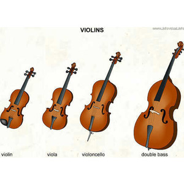

# Lesson 3

In Lesson 3 you will be modifying your index.html and about.html files to add SEMANTIC ELEMENTS and styling.  **SEMANTIC
ELEMENTS** are used section off types of content. http://www.w3schools.com/html/html5_semantic_elements.asp 

### Instructions
1. Open Notepad, or your favorite text editor.
2. Open index.html
3. Open about.html
4. Using the document below as a guide, apply tags to structure your index.html and about.html 
pages as created in previous lessons.


**Criteria for the Lesson 3 webpage:**
* Must define an area as your `<header>` (the top, usually logo/business name)
* Must define an area as a `<footer>` (the bottom, usually has copyright info)
* Must define a `<section>` (usually contains paragraphs or specific content)
* Define a navigation area (where links will go)
* Define links for at least "Home" "About" and "Contact", using # as the url.
* Set an ID to any element and create a link to it in the NAV area
* Pick a font you love and assign it as a font-family to at least your header

```HTML

<!doctype html> 
<html> 
	<head>    
		<title>My Page</title> 			
	
    <style>
    
    	h1 {
			font-family: sans-serif;
		}
		
		section {
			font-family: Tahoma;
		}
		
		.nathan {
			font-family: Webdings;
		}
		
		#symphonies {
			color: red;
		}
		
	</style>
		
		
	</head> 
<body> 
	<header><h1>Selecting a Concert Style</h1></header> 

	<nav>
<!-- Using the # symbol alone won't allow the links to go anywhere, but they look active and work for styling purposes. -->
	<a href="#">Home</a> | <a href="#">About</a> | <a href="#">Contact</a> |

<!-- hyperlinks can link to items on the same page by calling the ID -->
 <a href="#symphonies">Symphonies</a> | <a href="#raves">Raves</a>
	</nav>


<section>
<!-- An ID is set on this header. Clicking the symphonies link (#symphonies) will scroll to this point. -->
	<h1 id="symphonies">Symphonies</h1>   
	<p>A symphony is a type of musical composition generally performed by a full orchestra.</p>

</section> 


<section>
<!-- An ID is set on this header. Clicking the raves link (#raves) will scroll to this point. -->
	<h1 id="raves">Raves</h1>
	<p>A rave is a gathering of people who listen and dance to  music, especially electronic music, usually performed by a  live band or live DJs.</p>

</section> 


<footer><p class="nathan">Author: Nathaniel Becker</p></footer>

</body>
</html>
```

## Details

* `<link href="https://fonts.googleapis.com/css?family=Pacifico" rel="stylesheet">`
    * Fonts will only work if the person viewing the site has the font installed on your computer
    * By using a FONT LIBRARY such as fonts.google.com, everyone can see your font
    * When you browse http://fonts.google.com and find a font you like, click on it, then use the FAMILY SELECTED bar at the
    bottom to retrieve the "head" link.  This points back to the library so the browser pull it into your document.
    * **Always put this link between the `<head></head>` tags.**
    * Use `font-family: fontName;` in your stylesheet as needed.
* `<style></style>`
    * Contains CSS (Cascading Style Sheet) properties and attributes.
    * CSS uses the following format: SELECTOR {property: attribute;}
    * multiple properties and attributes may be used within the {} like so:
    
    ```HTML5
    h1{
        color: red; 
        font-family: Arial;}
    ```

* `h1 {font-family: sans-serif;}`
    * CSS: Styles `<h1></h1>` with the Sans-Serif font (text-style).
* `section {font-family: Tahoma;}`
    * CSS: Styles `<section></section>` with the Tahoma font (text style).
* `.nathan {font-family: Webdings;}`
    * CSS: Styles `<p class="nathan">` with the Webdings font (text style).
* `#symphonies {color: red;}`
    * CSS: Styles `<div id="symphonies">` with red text.

| TYPE | SELECTOR | PROPERTY | ATTRIBUTE |
| --- | --- | --- | --- |
| Element | h1 | {color: | red;} |
| Semantic Element | section | {color: | green;}|
| Class | .hello | {color: | blue;} |
| ID | #new | {color: | yellow; } |


* `<header></header>`
    * The `<header>` element specifies a header for a document or section. The `<header>` 
    element should be used as a container for introductory content.  You can have several 
    `<header>` elements in one document.
* `<nav></nav>`
    * The `<nav>` element defines a set of navigation links.
* `<section></section>`
    * A section is a thematic grouping of content, typically with a heading.  A home page could normally
     be split into sections for introduction and content.
* `<footer></footer>`
    * The `<footer>` element specifies a footer for a document or section. A `<footer>` element should
     contain information about its containing element.A footer typically contains the author of the
    document, copyright information, links to terms of use, contact information, etc.


# Challenge 3

Check out the Lesson 3 Challenge on Repl.it: https://repl.it/classroom/invite/CJuYkDU
